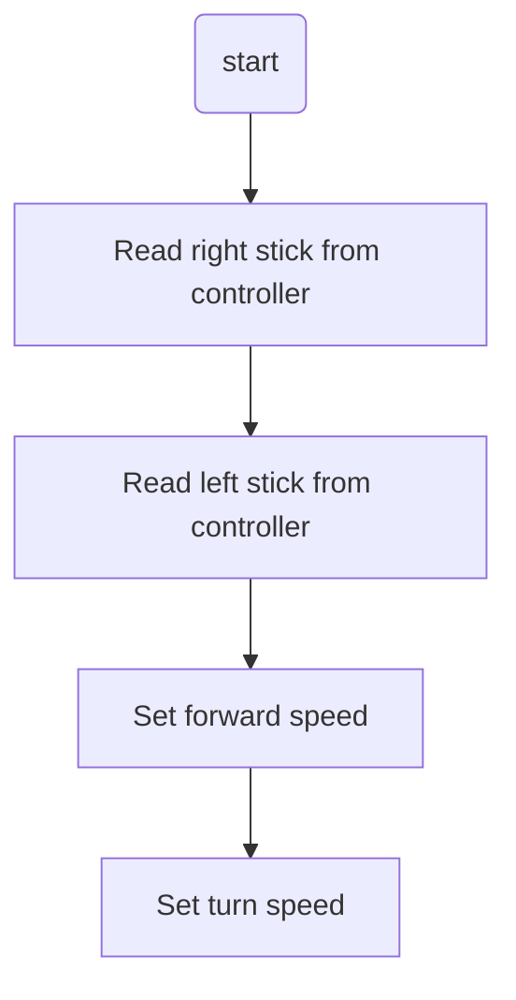

Welcome to learning **Arcade Drive!**. This tutorial is meant to prepare you for
both programming and learning how to design systems for command-based robots in FRC.
This tutorial assumes you have little to no experience in C++, and will walk you through
every step from project creation to driving a robot.If a section seems to boring/trivial,
skip to the next. In order to accomadate all skill levels, we'll start from almost zero.

## If it's your First Time Here...

If this is your first introduction to programming in the FRC ecosystem: **welcome!!**.

In FRC, robots are programmed using the C++ language alongside the [WPILib](https://docs.wpilib.org/en/stable/)
control system, which is essentially just a big tool box that we use to create software for the robots.
We won't dig into the guts here, but if you want to read more: follow the link above.

## So - Programming? 💻

We typically think of computers as **black boxes**: we click on pictures on a screen,
and somehow this magical box of silicon tricks spits out websites, games, videos,
and all manners of sorcery.

Turns out, it's not magic at all: just code! The robot you are about to write for
is no different, except it's missing everything we use to interract with a computer:
mouse, keyboard, screen, sound, etc.

This is an example of a so-called **embedded system**. From [Wikipedia](https://en.wikipedia.org/wiki/Embedded_system):

> "*An embedded system is a specialized computer system—a combination of a computer processor, computer memory, and input/output peripheral devices—that has a dedicated function within a larger mechanical or electronic system.*"

Long story short: it is a computer that has no way for you, the user, to give it input 
(at least in traditional ways). The computer is designed to do one thing over and over again,
without much complaining.

In FRC, the rules designate that we must use a **RoboRio 2 by National Instruments** that looks like this:


This is the comptuer you are writing code for! In ARGOS 1756, we use the **C++ language**,
but it is also possible to write code using **Python**, **Java**, and **LabView**.

If you don't know what a programming language is, it is just like any other language
(Spanish, French, German) but instead of talking beteween people, you are talking to comptuers.

## Meet **Your** Robot. 🤖

The NI RoboRio is pretty expensive, and requires a lot more hardware to get a 
minimal robot working, so we've decided to help you learn using
[Sparkfun's XRP Platform](https://www.sparkfun.com/xrp?gad_source=1&gad_campaignid=17479024030&gclid=EAIaIQobChMIwsvtz8qBjgMV0FtHAR2F1BCJEAAYASAAEgLHvvD_BwE):


The beautiful thing about this robot is you can program it using WPILib! This
makes it perfect for low-risk, low-cost training. This will be the robot you get
driving around with this tutorial.

## From Zero to "Hello World!" ✋ 

Go ahead and open another browser tab away from this one and go to 
[onlinegdb.com/online_c++_compiler](https://www.onlinegdb.com/online_c++_compiler) 
so you can write some code in your browser without downloading any of the complicated tooling.
(which you **will** need later to program the robot).

Commonly, programmers start a new language by writing a very simple program that
tells the user `Hello World!` it will print this message to the terminal. While
normal people don't typically interract with terminals, it offers a *very* simple 
way to get output from your code, to the user. 

!!! tip "Why no pretty windows?"

    Why would we use this "terminal" if we always have pretty buttons and text to click on?
    Well, put short: it's a lot more code to make things pretty. The terminal uses a 
    built-in feature to most operating systems called stdout (standard-out). This a much
    easier way to talk to a user.

For this exercise, just copy-paste the code below into the text editor on the website:

```c
#include <iostream>

int main()
{
    std::cout << "Hello, World!\n";

    return 0;
}
```

Click "Run" on the top, and see what happens! You should see the following output in the
terminal at the bottom:

```
Hello, World!
```

**Congradulations!!**

You just wrote your first C++ program. Take a minute to take in what each
of these lines sort of mean:

```c
#include <iostream> // Includes code that lives "elsewhere" 
                    //   (don't worry about what that means for now).
                    // This "iostream" gives me the ability to use the code
                    //   I've written below to print to the terminal.
int main()
{ // Everything between this open bracket and the following closing bracket is part of "main"

    // This is where your code will start running. We call "main" the "entry-point"
    //   because it is where your code will start running. main is special because
    //   the computer "looks for" this function to execute first.

    // The line below is what actually prints to the terminal
    std::cout << "Hello, World!\n";

    // returning the number zero means "the program worked OK!"
    return 0;

} // The end of "main"
```

!!! tip "Comments"

    Comments are those bits of text I wrote starting with `//`. Everything after `//` in a
    line the computer will ignore. These are called "comments" and programmers use them to
    communicate the intenet of code to other programmers.

Now you've written your first bit of magi- I mean code. While simple, this highlights a few
important concepts that you will need throughout the entirety of your hopefully long and 
prosperous software journey:

**Code executes from "top to bottom"**

First, we included, then we wrote the console, then we "returned" zero.

**Returning Values**

When you run a "function" (what "main" is) you can give values back to other parts
of code: which is what we are doing with the "0". We give it back to whatever called
(ran) our "main" function.

**Including Libraries**

We call collections of other people's (or our own) code "libraries", we can include these by...
well, the `#include` of course! For this case, in order to write the line
`std::cout << "Hello, World!\n";`, we need to include `iostream` which we do by writing: 
`#include <iostream>`. `iostream` contains some code that comes with C++ that helps us
write to the terminal.

## Quicksave Here for Later 💾

The last section was pretty much the most bare-bones basic example you can do with
any programming language. You can imagine that there is some complexities that lie
between printing "Hello World!" to a user and programming a robot with tons of 
motors, sensors, and moving parts. 

This is true, but don't let it overwhelm you. The most important thing to remember
is that every system can be broken up into little pieces. 

This tutorial is skipping a lot about C++ and programming in general to focus
specifically on writing code for robots. If you want, finish this tutorial then
come back here and follow a couple of these links to learn more general programming
and C++:

* [Codecademy Free C++ Course](https://www.codecademy.com/learn/learn-c-plus-plus)
* [FreeCodeCamp Youtube Video](https://www.youtube.com/watch?v=8jLOx1hD3_o)

For reference (looking up standard functions & libraries) I personally prefer:

* [Cpp Reference](https://cppreference.com/) - Fair warning: it's very wordy and technical

!!! example "CPP Reference Example"

    For example, if you wanted to know what all is inside `iostream` you can go
    [here](https://cppreference.com/w/cpp/header/iostream.html) and then from
    there read about [cout](https://cppreference.com/w/cpp/io/cout.html)

## Your Robotic Task 📎

Your task for the rest of this tutorial is to **get a robot to move**. 
Specifically, it needs to move in a way that we call **Arcade Drive**. 

**Arcade Drive** is just a way we use to describe what we expect the robot to do
when you move the two sticks on a classic x-box controller. The idea here is that
the left stick moves the robot forward/back and the right stick turns. For those
of you that play video games: yea it's that.

!!! warning "Assumptions About Software"

    This tutorial is making the assumption you are working on a machine that 
    has **all the tools you need installed for you** by your resident tech guru.
    If you're missing these tools, go summon your guru to bestow upon you the 
    tools needed to write code for robots.

First off, let's get a quick picture of what we want the robot to do:


Like we described before, the left stick controls the "power" either forward or
back from the robot, and the right stick controls the left and right "power".

## The Pre-Code Workout 📊

Before we write any code, it's important to make a **flow chart** of what we need
to do, in human readable tasks. When you are solving any problem in software,
it's important to do a step like this either in your head, or on paper.

Let's start with listing out the tasks we need to perform:

* Turn robot left and right
* Drive forward and back
* Read left stick from controller
* Read right stick from controller

Now that we have that, let's make a chart of what our code needs to do.
Programmers use flow charts a lot to visualize a plan for implementing code:



While simple, it's important to keep the tasks at hand striat. I will walk you 
through how to do each of these things in code in the next section.

## Project Creation & Setup 🏗️

!!! info "XRP Only"

    These instructions are designed for the **XRP robot ONLY**. Similar concepts
    apply for full-scale robots, but this is by no means an arcade tutorial
    for swerve drive. This code assumes that some things are present from 
    specifically the XRP example generated by WPILib

To start things off, you'll need to open **2025 VsCode** from the start menu / 
desktop. Wherever it is located.

From here, I will defer to WPILib for how to create the XRP project. Follow the instructions on
[this](https://docs.wpilib.org/en/stable/docs/xrp-robot/programming-xrp.html) 
page (including running the program) and then come back here when you are done.

!!! success

    Congrats!!! If you went to WPILib, followed the docs, and came back here:
    you just followed your first technical documentation tutorial!

### But... Where is `main`? I thought that's where code went?

Ok yes, you caught me. This is one of those "complexities" I mentioned earlier.
The `main` function here is burried deep, deeper than we will ever go into
the toolbox that is WPILib. We won't ever interract with it at all. 

You'll notice there are lots of files in this project, so it can be hard to 
tell where we start. For now: just accept that we will be primarily working
in the file `RobotContainer.cpp`. This file "contains" different **commands**
that will be run on the robot. (Imagine that, robot container *containing* the robot?)

!!! tip "VSCode Shortcut"

    Use the shortcut `ctrl+p` to get a search bar where you can type in any file
    name, and VSCode will take you there. You can also use `ctrl+shift+p` to get
    the command pallate, where you can type pretty much any command you can click.

Go ahead and open that `RobotContainer.cpp` file. It should be under: `/src/main/cpp`
inside of your project. Navigate to it using the shortcut from the tip above,
or with the explorer on the left.

This is where we will do most of our writing.

## Finally - Let's Write Some Code ✍️

Your file (`RobotContainer.cpp`) should look like this to start:

```cpp
// Copyright (c) FIRST and other WPILib contributors.
// Open Source Software; you can modify and/or share it under the terms of
// the WPILib BSD license file in the root directory of this project.

#include "RobotContainer.h"

#include <frc/smartdashboard/SmartDashboard.h>
#include <frc2/command/Commands.h>
#include <frc2/command/button/JoystickButton.h>

#include "commands/TeleopArcadeDrive.h"

RobotContainer::RobotContainer() {
  // Configure the button bindings
  ConfigureButtonBindings();
}

void RobotContainer::ConfigureButtonBindings() {
  // Also set default commands here
  m_drive.SetDefaultCommand(TeleopArcadeDrive(
      &m_drive, [this] { return -m_controller.GetRawAxis(1); },
      [this] { return -m_controller.GetRawAxis(2); }));

  // Example of how to use the onboard IO
  m_userButton.OnTrue(frc2::cmd::Print("USER Button Pressed"))
      .OnFalse(frc2::cmd::Print("USER Button Released"));

  frc2::JoystickButton(&m_controller, 1)
      .OnTrue(frc2::cmd::RunOnce([this] { m_arm.SetAngle(45_deg); }, {}))
      .OnFalse(frc2::cmd::RunOnce([this] { m_arm.SetAngle(0_deg); }, {}));

  frc2::JoystickButton(&m_controller, 2)
      .OnTrue(frc2::cmd::RunOnce([this] { m_arm.SetAngle(90_deg); }, {}))
      .OnFalse(frc2::cmd::RunOnce([this] { m_arm.SetAngle(0_deg); }, {}));

  // Setup SmartDashboard options.
  m_chooser.SetDefaultOption("Auto Routine Distance", &m_autoDistance);
  m_chooser.AddOption("Auto Routine Time", &m_autoTime);
  frc::SmartDashboard::PutData("Auto Selector", &m_chooser);
}

frc2::Command* RobotContainer::GetAutonomousCommand() {
  return m_chooser.GetSelected();
}
```

### Header Files

The *very* first thing I want to draw your attention to is the `#include` towards
the top:

```cpp
#include "RobotContainer.h"
```

You'll notice that this is including (or rather, taking the code of and using it here) 
a file called `RobotContainer.h`. This is actually a file located within our project at:
`src/main/include/RobotContainer.h`.

This is called a "Header" file. Most "parts" of software in any C++ projects
come in pairs of files. A "source" file (`RobotContainer.cpp`) and a "header" 
file: (`RobotContainer.h`). Each one has it's own job:

* The source file contains the "actual" code that is used on the robot.
* The header file tells other source files what to expect from your code.

I know that was probably a little confusing, but let's look at a concrete example:

Looking at the `RobotContainer.cpp` file, you'll see a couple functions with funny synatx:

```cpp
RobotContainer::RobotContainer() {
  // Stuff in here ...
}

void RobotContainer::ConfigureButtonBindings() {
  // Stuff in here ...
}

frc2::Command* RobotContainer::GetAutonomousCommand() {
  // Stuff in here ...
}
```

Now, use the explorer or `ctrl+p` shourtcut to look at the file `RobotContainer.h`:

```cpp
// Copyright (c) FIRST and other WPILib contributors.
// Open Source Software; you can modify and/or share it under the terms of
// the WPILib BSD license file in the root directory of this project.

#pragma once

#include <frc/Joystick.h>
#include <frc/smartdashboard/SendableChooser.h>
#include <frc/xrp/XRPOnBoardIO.h>
#include <frc2/command/Command.h>
#include <frc2/command/CommandPtr.h>
#include <frc2/command/button/Trigger.h>

#include "Constants.h"
#include "commands/AutonomousDistance.h"
#include "commands/AutonomousTime.h"
#include "subsystems/Arm.h"
#include "subsystems/Drivetrain.h"

/**
 * This class is where the bulk of the robot should be declared.  Since
 * Command-based is a "declarative" paradigm, very little robot logic should
 * actually be handled in the {@link Robot} periodic methods (other than the
 * scheduler calls).  Instead, the structure of the robot (including subsystems,
 * commands, and button mappings) should be declared here.
 */
class RobotContainer {
  // NOTE: The I/O pin functionality of the 5 exposed I/O pins depends on the
  // hardware "overlay"
  // that is specified when launching the wpilib-ws server on the Romi raspberry
  // pi. By default, the following are available (listed in order from inside of
  // the board to outside):
  // - DIO 8 (mapped to Arduino pin 11, closest to the inside of the board)
  // - Analog In 0 (mapped to Analog Channel 6 / Arduino Pin 4)
  // - Analog In 1 (mapped to Analog Channel 2 / Arduino Pin 20)
  // - PWM 2 (mapped to Arduino Pin 21)
  // - PWM 3 (mapped to Arduino Pin 22)
  //
  // Your subsystem configuration should take the overlays into account
 public:
  RobotContainer();
  frc2::Command* GetAutonomousCommand();

 private:
  // Assumes a gamepad plugged into channel 0
  frc::Joystick m_controller{0};
  frc::SendableChooser<frc2::Command*> m_chooser;

  // The robot's subsystems
  Drivetrain m_drive;
  Arm m_arm;
  frc::XRPOnBoardIO m_onboardIO;

  // Example button
  frc2::Trigger m_userButton{
      [this] { return m_onboardIO.GetUserButtonPressed(); }};

  // Autonomous commands.
  AutonomousDistance m_autoDistance{&m_drive};
  AutonomousTime m_autoTime{&m_drive};

  void ConfigureButtonBindings();
};
```

There's a lot to unpack here, but if you read carefully... you'll find each
of those functions we have in `RobotContainer.cpp`:

* `GetAutonomousCommand`
* `RobotContainer`
* `ConfigureButtonBindings`

All of these are inside a "class" which is another programming concept. Classes
are a little out of scope for this tutorial, but essentially: they are ways to 
organize code into objects. "Objects" in programming are models of real world
things. For instance, we could have a class that represents a toaster. 
Toasters have functions: `toastBread()`, `turnOff()` and "properties"
(something like color, or it's manufactured date).

I know that was a **BIG** tangent, but this is one of the few concepts that
is very easy to miss, but also *very* important to being able to read code.
If you are only reading the `.cpp` file, you're only getting half the story.

!!! tip "Header Shortcut"

    If you have already built your project, you can usually use `alt+o`
    (the lowercase letter 'o') to navigate between a cpp/h file. Try it
    on `RobotContainer.cpp`!

### Trimming the Fat

Okay so *technically* this project already implements arcade drive for you 
out of the box, but we want to do it ourselves. Go ahead and delete all of
the content in `ConfigureButtonBindings` in the `RobotContainer.cpp` file. 
Your file should now look like this:

```cpp
// Copyright (c) FIRST and other WPILib contributors.
// Open Source Software; you can modify and/or share it under the terms of
// the WPILib BSD license file in the root directory of this project.

#include "RobotContainer.h"

#include <frc/smartdashboard/SmartDashboard.h>
#include <frc2/command/Commands.h>
#include <frc2/command/button/JoystickButton.h>

#include "commands/TeleopArcadeDrive.h"

RobotContainer::RobotContainer() {
  // Configure the button bindings
  ConfigureButtonBindings();
}

void RobotContainer::ConfigureButtonBindings() {
}

frc2::Command* RobotContainer::GetAutonomousCommand() {
  return m_chooser.GetSelected();
}
```

Don't worry about the `RobotContainer` and the `GetAutonomousCommand` functions
for now, they aren't needed for what we are doing. We'll be focusing exclusively
on `ConfigureButtonBindings`, which is where commands are supposed to be
created. Don't worry: we'll show you how to create a command.

### Understanding Subsystems

### Default Commands?

### Writing our Drive Code

## Finish Line 🏃